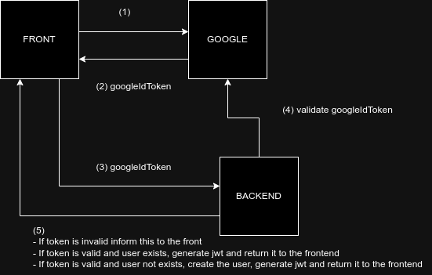

# Google sign in or sign up

This is going to be the google sign in or sign up flow used for the roadlink app:

- Google identity: 
  - website: [here](https://developers.google.com/identity)
  - video: [here](https://www.youtube.com/watch?v=Ys9N_pCFRDg)
- Use google id token on the backend: [here](https://developers.google.com/identity/one-tap/android/idtoken-auth)

TODO:
- cual es la diferencia entre google id y googleId token? cual cambia, cual no cambia?
- el token expira?
      - el jwt expira: como se genera?? --> clave pública privada.
- cuantos tokens hay? si hay 2 toikens mostrar los dos que hace cada uno?
- en el punto 4 cuando validas, qué haces?
      - te fijás si es válido y rompés en caso de que no sea válido?
      - validás y obtenes la info asociada al googleIdToken?

- mapear qué hacemos con el google id: se guarda en la db el la siguiente info -> EntityId, GoogleId, UserId
